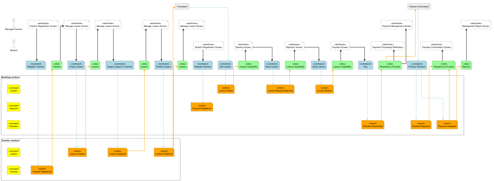

# Extensive example

This is an implementation of the example in [this post](https://developer.axoniq.io/w/from-model-to-code-event-modeling-axon-framework).

For comparison, the Miro board of this example can be viewed [here](https://miro.com/app/board/o9J_kobh9rI=/) (see the combined system).


```plantuml
@startuml
!include_once https://raw.githubusercontent.com/chilit-nl/plantuml-event-modeling/main/event-modeling-lib.iuml

$enableAutoAlias()
$enableAutoSpacing()

$configureWireframeLane(Manager/Teacher, $laneAlias = "Manager")
$configureWireframeLane(Student)
$configureEventLane(Lesson, $context = "Booking context")
$configureEventLane(Account, $context = "Booking context")
$configureEventLane(Payment, $context = "Booking context")
$configureEventLane(Lesson, $context = "Teacher context")
$configureEventLane(Teacher, $context = "Teacher context")

$wireframe(Teacher Registration Screen, Manager)
$command(Register Teacher)
$event(Teacher Registered, Teacher)
$view(Teacher)

$wireframe(Manage Lesson Screen, Manager)
$command(Create Lesson)
$event(Lesson Created, Lesson1)
$view(Lesson)

$wireframe(Manage Lesson Screen, Manager)
$command(Assign Lesson to Teacher)
$event(Lesson Assigned, Lesson1)
$view(Lesson)

$wireframe(Manage Lesson Screen, Manager)
$command(Publish Lesson)
$event(Lesson Published, Lesson1)
$view(Lesson)
$wireframe(Manage Lesson Screen, Manager)

$extra(Translation)
$eventarrow(Lesson Published, Translation)

$wireframe(Student Registration Screen, Student, $offset = 3)
$command(Register Account)
$event(Account Registered, Account)

$command(Add Lesson)
$commandarrow(Translation, Add Lesson)
$event(Lesson Added, Lesson)
$view(Lesson Availability)

$wireframe(Booking Screen, Student)
$command(Book Lesson)
$event(Lesson Request Rejected, Lesson)
$view(Lesson Availability)

$wireframe(Rejection Screen, Student)
$command(Book Lesson)
$event(Lesson Booked, Lesson)
$view(Lesson Availability)

$wireframe(Payment Screen, Student)
$command(Pay)
$event(Payment Requested, Payment)
$view(Payments to Process)

$wireframe(Payment Management Screen, Manager)
$wireframe(Payment Processing Notification, Student)
$arrow(Payments to Process, Payment Processing Notification)

$extra(Payment Automation, $offset = 7)
$eventarrow(Payments to Process, Payment Automation)
$command(Process Payment)
$event(Payment Rejected, Payment, $offset = 1)
$view(Payments to Process)
$wireframe(Payment Confirmation Screen, Student)

$event(Payment Accepted, Payment)
$commandarrow(Process Payment, Payment Accepted)
$eventarrow(Payment Accepted, Payments to Process1)
$view(Reports)

$wireframe(Management Report Screen, Manager)

$renderEventModelingDiagram()
@enduml
```