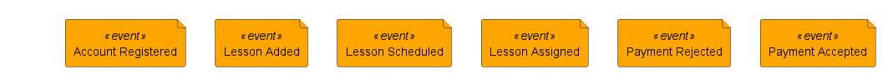
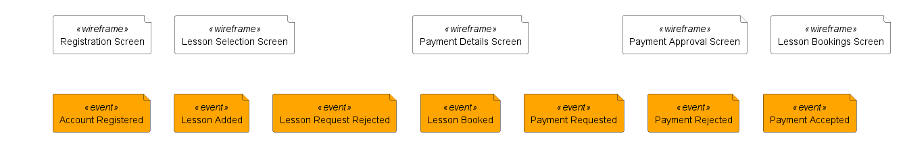
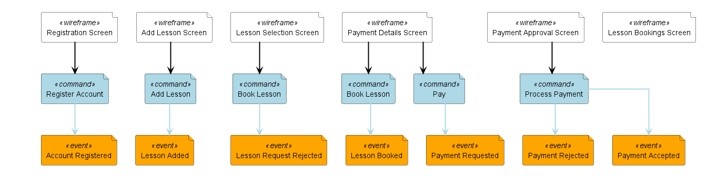
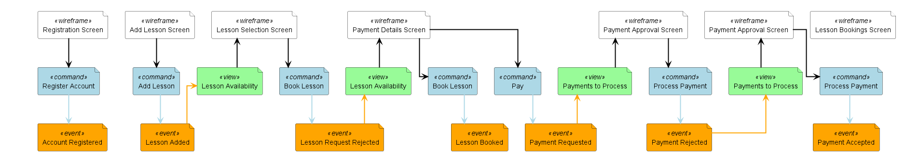
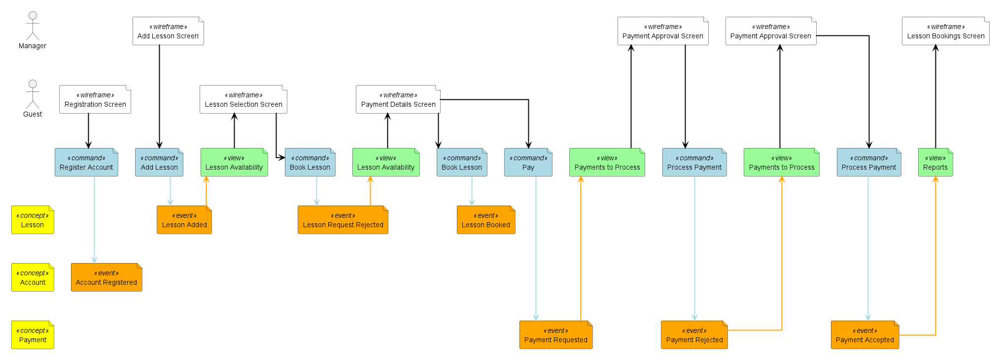

# Iterative Event Modeling Example

In the workshop format, event modeling is done in 7 steps. [Click here for more information](https://eventmodeling.org/posts/what-is-event-modeling/#seven-steps). This example demonstrates how the first 6 steps can be visualized with this library. The elements in this example are copied from [this post](https://developer.axoniq.io/w/from-model-to-code-event-modeling-axon-framework).

## Step 1 and 2: Brain Storming and The Plot
Events are identified and placed in a plausible timeline.


```
    @startuml
    !include_once https://raw.githubusercontent.com/chilit-nl/plantuml-event-modeling/main/event-modeling-lib.iuml
    
    $enableAutoAlias()
    $enableAutoSpacing()
    
    $event(Account Registered)
    $event(Lesson Added)
    $event(Lesson Scheduled)
    $event(Lesson Assigned)
    $event(Payment Rejected)
    $event(Payment Accepted)
    
    $renderEventModelingDiagram()
    @enduml
```

## Step 3: The Story Board
The user interaction is added through wireframe elements. The wireframe mockups are not visualized here to save time. If desired, they can be added as image elements.

```diff
    @startuml
    !include_once https://raw.githubusercontent.com/chilit-nl/plantuml-event-modeling/main/event-modeling-lib.iuml
    
    $enableAutoAlias()
    $enableAutoSpacing()
    
+   $wireframe(Registration Screen)
    $event(Account Registered)
    $event(Lesson Added)
    
+   $wireframe(Lesson Selection Screen)
    $event(Lesson Request Rejected)
    $event(Lesson Booked)
+   $wireframe(Payment Details Screen)
    $event(Payment Requested)
    
    $event(Payment Rejected)
+   $wireframe(Payment Approval Screen)
    $event(Payment Accepted)
+   $wireframe(Lesson Bookings Screen)
    
    $renderEventModelingDiagram()
    @enduml
```

## Step 4: Identify inputs
This step adds commands that flow from the wireframe elements to the events.

```diff
    @startuml
    !include_once https://raw.githubusercontent.com/chilit-nl/plantuml-event-modeling/main/event-modeling-lib.iuml
    
    $enableAutoAlias()
    $enableAutoSpacing()
    
    $wireframe(Registration Screen)
+   $command(Register Account)
    $event(Account Registered)
    
    $wireframe(Add Lesson Screen)
+   $command(Add Lesson)
    $event(Lesson Added)
    
    $wireframe(Lesson Selection Screen)
+   $command(Book Lesson)
    $event(Lesson Request Rejected)
    
    $wireframe(Payment Details Screen)
+   $command(Book Lesson)
    $event(Lesson Booked)
+   $arrow(Payment Details Screen, Pay)
+   $command(Pay)
    $event(Payment Requested)
    
    $wireframe(Payment Approval Screen, $offset = 4)
+   $command(Process Payment, $offset = 3)
    $event(Payment Rejected)
    $event(Payment Accepted)
+   $commandarrow(Process Payment, Payment Accepted)
    
    $wireframe(Lesson Bookings Screen)
    
    $renderEventModelingDiagram()
    @enduml
```

## Step 5: Identify outputs
The events are linked to views that fuel the output


```diff
    @startuml
    !include_once https://raw.githubusercontent.com/chilit-nl/plantuml-event-modeling/main/event-modeling-lib.iuml
    
    $enableAutoAlias()
    $enableAutoSpacing()
    
    $wireframe(Registration Screen)
    $command(Register Account)
    $event(Account Registered)
    
    $wireframe(Add Lesson Screen, $offset = 4)
    $command(Add Lesson)
    $event(Lesson Added, $offset = 1)
+   $view(Lesson Availability)
    
    $wireframe(Lesson Selection Screen)
    $command(Book Lesson)
    $event(Lesson Request Rejected)
+   $view(Lesson Availability)
    
    $wireframe(Payment Details Screen)
    $command(Book Lesson)
    $event(Lesson Booked)
    $arrow(Payment Details Screen, Pay)
    $command(Pay)
    $event(Payment Requested)
+   $view(Payments to Process)
    
    $wireframe(Payment Approval Screen, $offset = 4)
    $command(Process Payment, $offset = 3)
    $event(Payment Rejected)
+   $view(Payments to Process)
    $wireframe(Payment Approval Screen)
    $command(Process Payment)
    $event(Payment Accepted)
    
    $wireframe(Lesson Bookings Screen)
    
    $renderEventModelingDiagram()
    @enduml
```

## Step 6: Organize into swimlanes
All wireframe and event elements are assigned to lanes, grouping by user or concept.


```diff
    @startuml
    !include_once https://raw.githubusercontent.com/chilit-nl/plantuml-event-modeling/main/event-modeling-lib.iuml
    
    $enableAutoAlias()
    $enableAutoSpacing()
    
+   $configureWireframeLane(Manager)
+   $configureWireframeLane(Guest)
+   $configureEventLane(Lesson)
+   $configureEventLane(Account)
+   $configureEventLane(Payment)
    
!   $wireframe(Registration Screen, Guest)
    $command(Register Account)
!   $event(Account Registered, Account)
    
!   $wireframe(Add Lesson Screen, Manager, $offset = 4)
    $command(Add Lesson)
!   $event(Lesson Added, Lesson, $offset = 1)
    $view(Lesson Availability)
    
!   $wireframe(Lesson Selection Screen, Guest)
    $command(Book Lesson)
!   $event(Lesson Request Rejected, Lesson)
    $view(Lesson Availability)
    
!   $wireframe(Payment Details Screen, Guest)
    $command(Book Lesson)
!   $event(Lesson Booked, Lesson)
    $arrow(Payment Details Screen, Pay)
    $command(Pay)
!   $event(Payment Requested, Payment)
    $view(Payments to Process)
    
!   $wireframe(Payment Approval Screen, Manager, $offset = 4)
    $command(Process Payment, $offset = 3)
!   $event(Payment Rejected, Payment)
    $view(Payments to Process)
    
!   $wireframe(Payment Approval Screen, Manager)
    $command(Process Payment)
!   $event(Payment Accepted, Payment)
    $view(Reports)
    
!   $wireframe(Lesson Bookings Screen, Manager)
    
    $renderEventModelingDiagram()
    @enduml
```