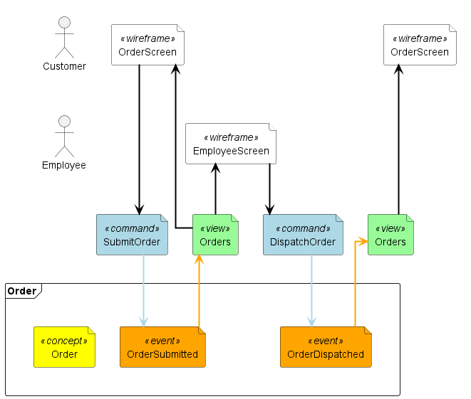
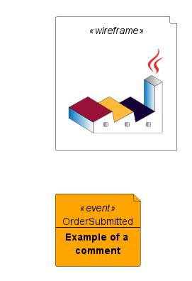

# Event Modeling library for PlantUML

This library is built for fast creation of [Event Modeling](https://eventmodeling.org/) diagrams in PlantUML. The layout is generated automagically from the elements you provide, powering rapid iteration during Event Modeling sessions.

Note: only the default GraphViz layout engine of PlantUML is supported.

## Quick example

```plantuml
@startuml
!include_once https://raw.githubusercontent.com/chilit-nl/plantuml-event-modeling/main/event-modeling-lib.iuml

$enableAutoAlias()
$enableAutoSpacing()

' Configure the names of the lanes
$configureWireframeLane(Customer)
$configureWireframeLane(Employee)
$configureEventLane(Order, $context = Order)

' Provide all elements in order
$wireframe(OrderScreen, Customer)
$command(SubmitOrder)
$event(OrderSubmitted, Order)
$view(Orders)
$arrow(Orders, OrderScreen)

$wireframe(EmployeeScreen, Employee)
$command(DispatchOrder)
$event(OrderDispatched, Order)
$view(Orders)
$wireframe(OrderScreen, Customer)

' Render the diagram
$renderEventModelingDiagram()
@enduml
```
[Live edit this example](https://www.plantuml.com/plantuml/uml/XP912zim38Nl_XKU19P0qzm7WvQsjusDzR3ZS1mr4TXoiELs-_Tpd1fIMDbHxtkHdXGV0YlFqHhn0KcREC0lHnhan3o7JrtdrMC_8a-nZm6yTiH0lDVETdf2WzoIwMQZQ6dHmZt1rhe13DBOMONKlMgjmNwFopXH0QdUm36oEnfKeMwsqdLMElcJA3xAawCRZj63v0aaAGj1kbikqcW8ejB5yHCzt7noV4cWFiN0pe9ltZekTZRk3y3MSLaYP_hD3-1tSa4Clrb-bbd9eRvxTyS1f396WW4Bn44YIRSuHFKeOzOcL-q1Q2TV4bchQAYliRV8pyPLljVwpGeOXfqiz8xmM658bVBUbJ9xofn6R0EK7Kk6Kcyod37CYlNqZnG5lO_ntrNJjNu09PH_sO1gJ6vH-QpbQtzzle_pokf671ACrlm5)

## More examples


[Iterative example during an event Modeling session](examples/iterative-example.md)


[Extensive example](examples/extensive-example.md)

## Background
This library was developed for live creation of Event Modeling diagrams during Event Modeling sessions. The layout and styling options are limited, mainly due to how PlantUML works. If you want to fully style and position the elements yourself, this library is not for you.

It was inspired by the [AxonIQ Event Modeler](https://morlack.github.io/eventmodeler/) stub. It expands upon it by adding wireframe lanes, visualizing contexts, and giving much more flexibility. By building on PlantUML this library allows for wide [compatibility](https://plantuml.com/running) and many exporting options.

## Available instructions

Note that parameters with `= ""` are optional. Parameters can be individually addressed like this: `$event(order, $alias = orderAlias)`

Configuration:

- **$enableAutoAlias()** - Automatically generates aliases for elements with duplicate names (Order becomes: Order, Order1, Order2, etc.). This has to be enabled explicitly to inform the user that the aliases are generated.
- **$enableAutoSpacing()** - Automatically positions elements horizontally based on the order of definition. Due to limitations of PlantUML the positioning is not perfect. The resulting position can be adjusted with the $offset parameter on an element.
- **\$configureWireframeLane($laneAlias, $headingName = "", $headingAlias = "")** - Provides the lane with an alias, which is used to reference the lane when adding a wireframe element. The actor at the beginning of the lane is named with $headingName, which defaults to $laneAlias
- **\$configureEventLane($laneAlias, $headingName = "", $headingAlias = "", $context = "")** - similar to $configureWireframeLane, but allows for defining a bounded context for this lane.
- **\$configurePolicyLane($laneAlias, $headingName = "", $headingAlias = "", $context = "")** - similar to $configureWireframeLane, but allows for defining a saga context for this lane.

Adding elements:

- **\$wireframe($name, $laneAlias = "defaultLane", $offset = 0, $arrow = 1, $alias = "", $figure = $default_figure)**
    - **$name** - The visible name of the element
    - **$laneAlias** - The lane where this element is placed
    - **$offset** - Change the horizontal positioning
    - **$arrow** - Boolean determining if an arrow is generated from the previous element to this one. Illogical arrows (e.g. from an event to and event) are never automatically generated.
    - **$alias** - Manually provide an alias to reference this element by. This can be useful when renaming the element without having to adjust the references.
    - **$figure** - Allows changing the visual figure for this element. All PlantUML figures for the [deployment diagram](https://plantuml.com/deployment-diagram) are available.
- **\$command($name, $offset = 0, $arrow = 1, $alias = "", $figure = $default_figure)**
- **\$view($name, $laneAlias = "defaultLane", $offset = 0, $arrow = 1, $alias = "", $figure = $default_figure)**
- **\$event($name, $laneAlias = "defaultLane", $offset = 0, $arrow = 1, $alias = "", $figure = $default_figure)**
- **\$extra($name, $offset = 0, $arrow = 1, $alias = "", $figure = $default_figure)** - These elements are placed at the top lane and can be used for e.g. translation, automation, and sagas.

Adding arrows:

- **\$arrow($from, $to)** - Draws an arrow between the $from and $to elements, indicated by their alias.
- **\$commandarrow($from, $to)** - Applies "command" style
- **\$eventarrow($from, $to)** - Applies "event" style

Rendering:

- **$renderEventModelingDiagram()** - This instruction must be placed after all other instructions. It renders the diagram to PlantUML.

## Layout and styling
The elements can be horizontally moved by modifying the $offset of each element. This is not with pixel-precision due to PlantUML limitations.

Element styling can be done by overriding the style (see under [Customization](#customization)). The PlantUML [styling options](https://plantuml.com/style-evolution) are poorly documented at this moment and not all options may work.

Text styling and images are possible using [PlantUML creole syntax](https://plantuml.com/creole). For example:

```plantuml
@startuml  
!include_once event-modeling-lib.iuml  
  
$wireframe(, $alias = "imageElement")
$event(OrderSubmitted\n---\n<b>Example of a \n<b>comment, $alias = "OrderSubmitted")  
  
$renderEventModelingDiagram()  
@enduml
```


## Customization
All styles, variables, and procedures defined in the library can be overridden by redefining them after the include:

  ```plantuml
@startuml  
!include_once event-modeling-lib.iuml

' Override defaults
<style>  
    .event {  
	    BackgroundColor pink
	}
</style>

!$default_figure = "rectangle"

' Add configuration and elements here

' Render the diagram
$renderEventModelingDiagram()

@enduml
```

## Inner workings
The main challenge this library solves is that PlantUML is not a layout engine. Creating the lane structure of Event Modeling is generally not possible in PlantUML. (The existing lanes in specific PlantUML diagram types such as activity diagrams do not permit creating something like an Event Modeling diagram.)

This library forces PlantUML in a specific layout by making assumptions on how the default GraphViz layout engine works. It adds hidden arrows with layout hints, adds containers, and outputs the elements in a specific order, so that the generated layout resembles an Event Modeling diagram.

The library has two phases: a recording phase and a rendering phase. In the recording phase all elements, lanes and arrows are recorded into a data structure. In the rendering phase, all the recorded elements are outputted in the correct way to get the desired layout.

The "datastructures" used are not real data structures. The [PlantUML preprocessor](https://plantuml.com/preprocessing) only allows for variable storage. No classes, structs, and not even arrays. (The JSON datastructure in PlantUML is read-only unfortunately.) This library circumvents this limitation by generating variable names (such as $event-1-items-0-name) and using those to create pseudo-datastructures.

## Wishlist
 - IDE plugin(s) for syntax highlighting and autocompletion, optimized for this library
